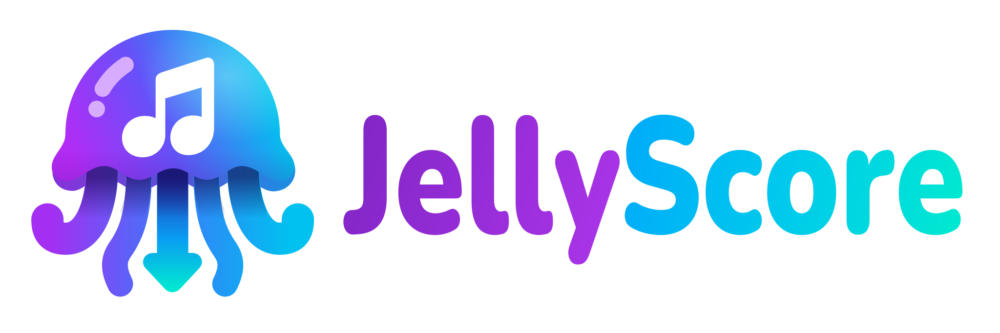

# JellyScore



Jellyfin plugin targeting server **12.0+** (.NET 10). Finds conservative theme recordings for new movies and physical TV series. Nothing is downloaded on installation. A selected-library rescan is available on the plugin dashboard.

## Install

In Jellyfin 12+, open **Dashboard → Plugins → Repositories** and add:

```text
https://raw.githubusercontent.com/edmogeor/jellyfin-theme-songs/manifest-release/manifest.json
```

Then install **JellyScore** from the plugin catalog and restart Jellyfin. The single plugin archive contains yt-dlp for supported Linux (glibc and musl, x64 and arm64), Windows (x64 and arm64) and macOS (x64 and arm64). The plugin uses Jellyfin's configured FFmpeg and FFprobe. No API key or executable paths are required.

To build the same archive manually, run `bash package.sh` and install `dist/ThemeSongs.zip`. Packaging resolves the latest upstream yt-dlp release once and verifies SHA-256 checksums for every bundled binary. Set `YT_DLP_VERSION` to pin a particular release.

Select movie and TV libraries on the plugin page, or run a manual full rescan. Automatic processing of newly added items is enabled by default, but only selected libraries are processed. The scan shows progress, a rough time estimate, and recent skipped items with their reasons. The media folders must be writable by Jellyfin. Externally changed themes and removed library items leave the managed list without deleting user files. Deletes pause automatic matching for that item until a full rescan.

YouTube search without an API key depends on yt-dlp's extraction and can require a newer yt-dlp package when YouTube changes. The matcher deliberately skips ambiguous or unverified results. Review YouTube access and content rights for your deployment.

## Development

Run `make setup` to restore .NET tooling, `make check` to verify formatting, linting and builds against Jellyfin 12.0 and 12.1, or `make test-unit` for matching checks. `make test-e2e` starts a clean Docker Jellyfin 12 instance with two movies and two series, scans both libraries, and checks a real movie theme download plus refresh and deletion. `make test-smoke` checks the same Docker server and admin API without YouTube, which is the mode run on GitHub-hosted CI where YouTube access may fail. `make up` keeps a server at `http://127.0.0.1:18096` for manual testing. The test admin login is `user` / `password`. Docker, Python 3, curl and the .NET 10 SDK are needed for the end-to-end setup.
